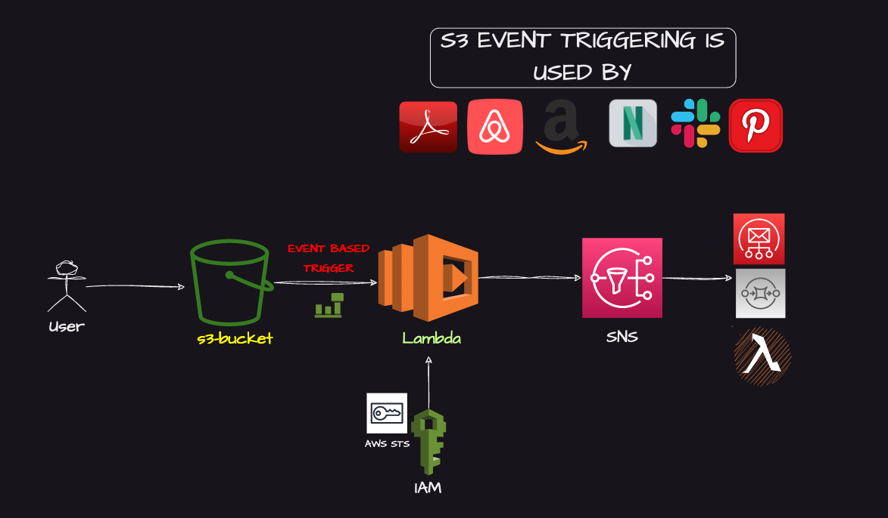

# AWS S3 Event Triggering with Shell Scripting

## Project Overview

This project implements AWS S3 Event Triggering using Shell Scripting to automate notifications through AWS Lambda and SNS (Simple Notification Service). The main goal is to provide real-time alerts when specific events occur in an S3 bucket.

---

---
Here are some examples that use S3 event triggering:

Netflix: Netflix use S3 event triggering to automatically process video files uploaded to Amazon S3, enabling seamless content ingestion and processing.

Airbnb: This lodging and homestays aggregator use S3 event triggering to automatically process and analyze data stored in Amazon S3, such as guest reviews and booking information.

Expedia: They use S3 event triggering to automatically process and analyze data stored in Amazon S3, such as travel bookings, user profiles, and pricing information, to power their personalized travel recommendations and search features.

---

## License

This project is licensed under the MIT License.